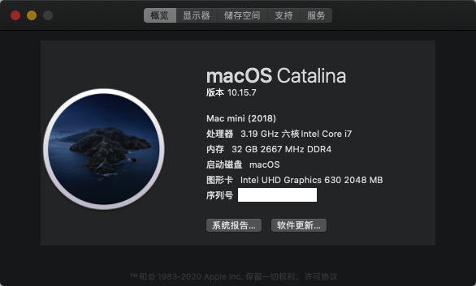

# DeskMini 310 Open Core EFI

# 配置
- Motherboard/主板: DeskMini h310
- CPU: i7-8700 (Intel UHD Graphics 630)
- External Hard Drive/硬盘: Samsung PM961 512G M.2 NVME
- RAM/内存: Samsung DDR4 2666MHz 16GB x2
- Wireless Card/网卡: 无

# 系统/软件
- macOS Catalina (10.15.7)
- opencoreconfigurator0.7.7 MOD修改版

# BIOS
- CPU Configuration, CPU C states Support, Enabled,
- CPU Configuration, CPU C states Support, CFG Lock Disabled (必须）
- Chipset Configuration, Vt-d, Disabled,
- Chipset Configuration, Onboard HD Audio: Enabled,
- USB Configuration, XHCI Hand-off, Enabled （关键）
- Super IO Configuration, Serial Port, Disabled（必须）
- Security Secure Boot, Disabled(by default)
- Boot, CSM, disabled
